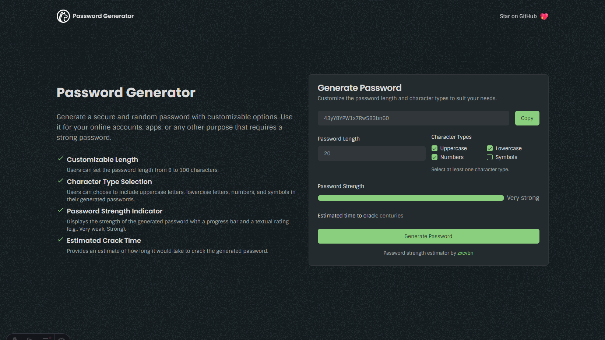

# Safecy Password Generator

Welcome to the Safecy Password Generator! This tool is built with Astro, Tailwind CSS, and TypeScript to help you create strong and customizable passwords.



## Features

- **Strong Password Generation**: Create robust passwords tailored to your needs.
- **Customizable Length**: Specify the length of your passwords.
- **Character Selection**: Choose which types of characters (letters, numbers, symbols) to include.
- **Cracking Time Estimate**: Receive an estimate of how long it would take to crack the generated password.

## Installation

1. **Clone the Repository**:s
   ```bash
   git clone https://github.com/Safecy/password-generator.git
   cd password-generator
   ```
2. **Install Dependencies**:
   ```bash
   npm install
   # or
   pnpm install
   ```
3. **Start the Development Server**:
   ```bash
   npm run dev
   # or
   pnpm run dev
   ```

## Usage

1. **Open the Application**: Navigate to `http://localhost:4321` in your browser.
2. **Generate a Password**: Use the interface to select your desired password length and character types.
3. **View Strength Estimate**: Check the estimated time to crack the generated password.

## Technologies Used

- **Astro**: Modern static site generator.
- **Tailwind CSS**: Utility-first CSS framework.
- **TypeScript**: Typed JavaScript for scalable development.

## Contributing

We welcome contributions! If you'd like to add a new feature or fix a bug, please open a pull request or an issue. Make sure to follow the [Prettier configuration](https://prettier.io/docs/en/configuration.html).

## License

This project is licensed under the MIT License. See the [LICENSE](LICENSE) file for details.
